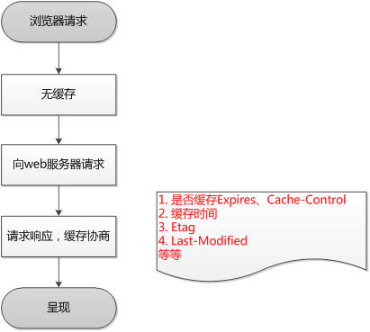
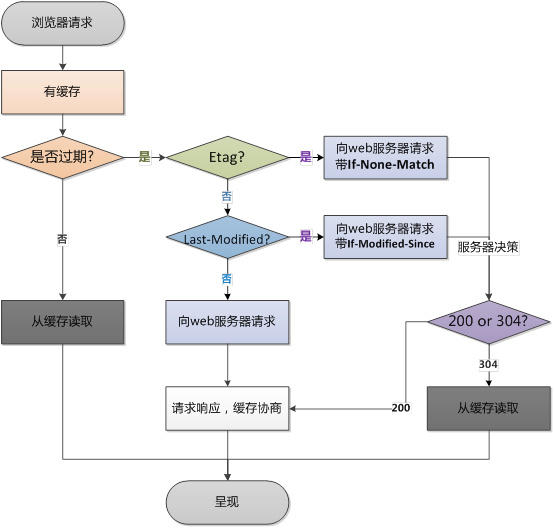

# 面试准备
#### 1.javascript的基础  
#### 2.nodejs基础  
#### 3.前端工程化
#### 4.前端性能优化
#### 5.css及周边
#### 6.三大框架基础
#### 7.前端跨界的应用
#### 8.图形化相关
#### 9.数据结构与算法  
#### 10.前端新技术及网络相关  
***  
## 1.javascript的基础  
略
## 2.nodejs基础  

[所有答案](https://www.jianshu.com/p/936d00cb23d8)

### 单个分析
1.大家在开发Node.js的时候都知道异步的嵌套非常麻烦，有人叫回调地域有人叫回调黑洞，请问如何解决这个问题？  
回答：promise async await  可以观看阮一峰的[文章](http://www.ruanyifeng.com/blog/2015/04/generator.html);  
2.如何解释NodeJS 适用于IO密集型不适用CPU密集型  
略    [Node.js软肋之CPU密集型任务](http://www.infoq.com/cn/articles/nodejs-weakness-cpu-intensive-tasks/)  
3.请画出Node.js的异步事件回调机制的实现,并解释原理  
略  
4.题目略  
答:unit 指的是一小块业务逻辑，可以使一个小组件、一个小函数、一个小类等,通常用karma+jasmine测试  
service 主要是用 mocha+chai 异步测试  
UI 主要是用 selenium-webdriver或者nightwatch   
5、有人说Node.js是玩具，写错一处整个网站都挂掉，有什么解决办法？  
① 使用errorHandler处理对应的错误，如404等  
② 用SafeRequest替代request  
③ 容错，PM2 0秒热启功能（守护进程）  
④ 电话，邮件，日志等出错的通知机制  
⑤ 用process提供了一个事件uncaughtException进行抓取异常进行处理  

<code>

    process.on('uncaughtException', function(err){
        console.log(err);  
        console.log(err.stack);  
    });
</code> 

⑥ 企业级错误监测产品，如腾讯的bugly    

6、写出知道的HTTP常用请求报头，并写出常见的HTTP status code含义？  
答：常用的HTTP请求报头(Request Headers)  
Cache-Control   用于指定缓存指令  
Accept请求报头域用于指定客户端接受哪些类型的信息。  
Accept-Charset请求报头域用于指定标明浏览器可以使用的字符集  
Accept-Encoding用于指定可接受的内容编码  
Accept-Language它是用于指定一种自然语言  
Connection客户是否能够处理持续性HTTP连接  
Content-Length只适用于POST请求，用来给定POST数据的大小  
Cookie向服务器返回cookie，这些cookie是之前服务器发送给浏览器的。  
Host浏览器和其他客户端程序需要制定这个报头，它标明原始URL中给出的主机名和端口号。  
Use-Agent标识生产请求的浏览器或其他客户端程序，根据这个报头，可以针对不同类型的浏览器返回不同的内容。   

7、请用Koa2实现基本的服务端，并输出Hello world，且实现功能测试。  
#### 功能代码  

<code>

    const Koa = require('koa');
    const app = new Koa();
    app.use(ctx => {
        ctx.body = Hello world'';
    }
    app.listen(3000);
</code>

#### 功能测试代码  

<code>

    const app = require('app');
    const request = require('supertest').agent(app.listen());
    describe('Hello world', function(){
        it('should say "Hello world" ', function(done){
                request
                .get('/')
                .expect(200)
                .expect('Hello world', done);
        })
    })
</code>

**supertest=接口测试**  
8、描述何种情况下会造成Node.js的内存泄漏，如何检测？  
答：① 全局变量  
这种比较简单的原因，全局变量直接挂在 root 对象上，不会被清除掉。  
② 闭包  
闭包会引用到父级函数中的变量，如果闭包未释放，就会导致内存泄漏。  
③ 过大的数组循环  
9、描述一下当下新时代的前端中Node.js的作用及其实际应用？以及一般Node.js项目文件夹的划分？  
答：作用及应用：  
① 作为数据中间代理层，转发数据  
② 为前端提供路由  
③ 封装后端接口  

文件夹的划分：  
models：请求数据  
controller：路由配置  
public：静态资源  
views：模板文件  
libs：公共文件  
config：配置文件  
test：测试文件  
app.js启动文件  

10、浏览器缓存机制。  
浏览器第一次请求：   
浏览器再次请求时： 

## 3.前端工程化  
1.请你说明前端开发中为何需要工程化  

### 模块化
简单来说，模块化就是将一个大文件拆分成相互依赖的小文件，再进行统一的拼装和加载。只有这样，才有多人协作的可能。
#### JS的模块化
在ES6之前，JavaScript一直没有模块系统，这对开发大型复杂的前端工程造成了巨大的障碍。对此社区制定了一些模块加载方案，如CommonJS、AMD和CMD等，某些框架也会有自己模块系统，比如Angular1.x。现在ES6已经在语言层面上规定了模块系统，完全可以取代现有的CommonJS和AMD规范，而且使用起来相当简洁，并且有静态加载的特性。规范确定了，然后就是模块的打包和加载问题：
1. 用Webpack+Babel将所有模块打包成一个文件同步加载，也可以打成多个chunk异步加载；
2. 用SystemJS+Babel主要是分模块异步加载；
3. 用浏览器的<code>\<script type="module"></code>加载目前Webpack远比SystemJS流行。Safari已经支持用type="module"加载了。
#### CSS的模块化
虽然SASS、LESS、Stylus等预处理器实现了CSS的文件拆分，但没有解决CSS模块化的一个重要问题：选择器的全局污染问题。  
按道理，一个模块化的文件应该要隐藏内部作用域，只暴露少量接口给使用者。而按照目前预处理器的方式，导入一个CSS模块后，已存在的样式有被覆盖的风险。虽然重写样式是CSS的一个优势，但这并不利于多人协作。  
为了避免全局选择器的冲突，各厂都制定了自己的CSS命名风格：BEM风格；
Bootstrap风格；Semantic UI风格；我们公司的NEC风格；  
但这毕竟是弱约束。选择器随着项目的增长变得越多越复杂，然后项目组里再来个新人带入自己的风格，就更加混乱了。所以我很赞同这句话：与其费尽心思地告诉别人要遵守某种规则，以规避某种痛苦，倒不如从工具层面就消灭这种痛苦。  
从工具层面，社区又创造出Shadow DOM、CSS in JS和CSS Modules三种解决方案。
* Shadow DOM是WebComponents的标准。它能解决全局污染问题，但目前很多浏览器不兼容，对我们来说还很久远；
* CSS in JS是彻底抛弃CSS，使用JS或JSON来写样式。这种方法很激进，不能利用现有的CSS技术，而且处理伪类等问题比较困难；
* CSS Modules仍然使用CSS，只是让JS来管理依赖。它能够最大化地结合CSS生态和JS模块化能力，目前来看是最好的解决方案。Vue的scoped style也算是一种。
#### 资源的模块化
Webpack的强大之处不仅仅在于它统一了JS的各种模块系统，取代了Browserify、RequireJS、SeaJS的工作。更重要的是它的万能模块加载理念，即所有的资源都可以且也应该模块化。  
资源模块化后，有三个好处：  
* 依赖关系单一化。所有CSS和图片等资源的依赖关系统一走JS路线，无需额外处理CSS预处理器的依赖关系，也不需处理代码迁移时的图片合并、字体图片等路径问题；
* 资源处理集成化。现在可以用loader对各种资源做各种事情，比如复杂的vue-loader等等。
* 项目结构清晰化。使用Webpack后，你的项目结构总可以表示成这样的函数：dest = webpack(src, config)
#### 组件化
首先，组件化≠模块化。好多人对这两个概念有些混淆。
* 模块化只是在文件层面上，对代码或资源的拆分；
* 而组件化是在设计层面上，对UI（用户界面）的拆分。从UI拆分下来的每个包含模板(HTML)+样式(CSS)+逻辑(JS)功能完备的结构单元，我们称之为组件。其实，组件化更重要的是一种分治思想。Keep Simple.Everything can be a component.
这句话就是说页面上所有的东西都是组件。页面是个大型组件，可以拆成若干个中型组件，然后中型组件还可以再拆，拆成若干个小型组件，小型组件也可以再拆，直到拆成DOM元素为止。DOM元素可以看成是浏览器自身的组件，作为组件的基本单元。传统前端框架/类库的思想是先组织DOM，然后把某些可复用的逻辑封装成组件来操作DOM，是DOM优先；而组件化框架/类库的思想是先来构思组件，然后用DOM这种基本单元结合相应逻辑来实现组件，是组件优先。这是两者本质的区别。其次，组件化实际上是一种按照模板(HTML)+样式(CSS)+逻辑(JS)三位一体的形式对面向对象的进一步抽象。所以我们除了封装组件本身，还要合理处理组件之间的关系，比如（逻辑）继承、（样式）扩展、（模板）嵌套和包含等，这些关系都可以归为依赖。其实组件化不是什么新鲜的东西，以前的客户端框架，像WinForm、WPF、Android等，它们从诞生的那天起就是组件化的。而前端领域发展曲折，是从展示页面为主的WebPage模式走过来的，近两年才从客户端框架经验中引入了组件化思想。其实我们很多前端工程化的问题都可以从客户端那里寻求解决方案。目前市面上的组件化框架很多，主要的有Vue、React、Angular 2、我们公司 @郑海波 的Regular、Avalon等。你感兴趣可以都研究一下，选择一套中意的。其实Vue文档中的对比其他框架一文已经讲得很详细了。
#### 规范化
模块化和组件化确定了开发模型，而这些东西的实现就需要规范去落实。规范化其实是工程化中很重要的一个部分，项目初期规范制定的好坏会直接影响到后期的开发质量。我能想到的有以下一些内容：目录结构的制定编码规范前后端接口规范文档规范组件管理Git分支管理Commit描述规范定期CodeReview视觉图标规范...其中编码规范最好采取**ESLint**和**StyleLint**等强制措施，配置git hooks可以实现Lint不过不能提交代码等机制，因为人是靠不住的。前后端接口管理可以了解一下我们公司出的NEI - 接口管理平台。
#### 自动化
作了这么多年程序猿的我，一直秉持的一个理念是：任何简单机械的重复劳动都应该让机器去完成。所以我也认为，前端工程化的很多脏活累活都应该交给自动化工具来完成。
* 图标合并不要再用PS拼雪碧图了，统一走Webpack吧；不要再用Icomoon了，统一走Webpack吧。
* 持续集成
* 自动化构建
* 自动化部署
* 自动化测试前端

2.请绘制代码版本仓库多分支的流程图以及如何用Node实现自动化分支构建  
3.请说明Grunt、Gulp、Webpack、Rollup、FIS的优缺点  
[答案](http://webpack.wuhaolin.cn/1%E5%85%A5%E9%97%A8/1-2%E5%B8%B8%E8%A7%81%E7%9A%84%E6%9E%84%E5%BB%BA%E5%B7%A5%E5%85%B7%E5%8F%8A%E5%AF%B9%E6%AF%94.html)  
注意webpack4的新特性  
[关于rollup](http://www.rollupjs.com/)  
4.略  
5.请简述一下你知道的自动化部署的框架和流程以及意义？  
[持续集成是什么？](http://www.ruanyifeng.com/blog/2015/09/continuous-integration.html)  
[Jenkins + Docker 项目持续部署实践](https://blog.kinpzz.com/2017/06/08/jenkins-docker-ci-cd/)

6.描述一下Webpack entry、output、module、plugins、resolve模块的作用  
* [webpack优化相关](https://github.com/lcxfs1991/blog/issues/2)(优化)  
* [如何 10 倍提高你的 Webpack 构建效率](https://segmentfault.com/a/1190000005770042)  
* [Webpack 学习 ](https://github.com/thoughtbit/it-note/issues/28)
* [webpack 使用总结](http://www.ferecord.com/webpack-summary.html#resolve)(全面)  

7.请用X-Tag 实现一个你能力范围内 Web Components  

[vue机制-Virtual DOM的简单实现](https://segmentfault.com/a/1190000012850255)  
[vue内部机制](https://github.com/answershuto/learnVue)
